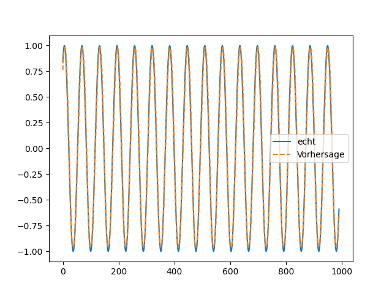

# KI-Framework from Scratch

Ein Framework für neuronale Netze, komplett selbst implementiert in Python, nur mit NumPy. Ziel war es, die Mathematik hinter Backpropagation und rekurrenten Netzen von Grund auf zu verstehen.

## Features
- Dense-Layer, ReLU, Dropout
- Gradient-Descent-Optimizer
- RNN und LSTM mit Backpropagation Through Time
- Loss: MSE

## Ergebnisse
- **MNIST:** 97 % Testgenauigkeit mit einem mehrschichtigen Perzeptron
- **Sinus-Vorhersage:** RNN und LSTM getestet. Das RNN schnitt besser ab, weil beim Sinus nur kurze Abhängigkeiten wichtig sind und das kleinere Modell hier im Vorteil ist.

## Struktur
- `NN/` – Dense-Layer, Aktivierungen, Optimizer
- `RNN/` – rekurrentes Netz
- `LSTM/` – LSTM-Zelle und Training

## Ausführen
python -m LSTM.Test